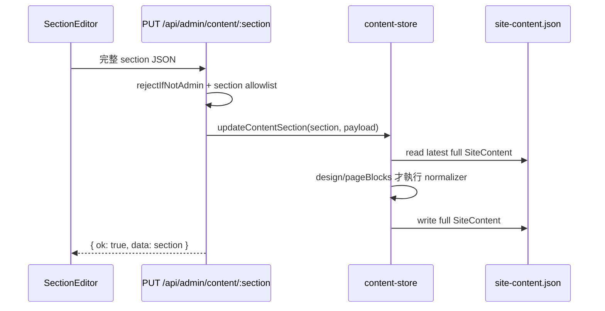

# OFFICE NEXT Draft／Publish Workflow v1 技術設計

> 文件性質：第一階段「現有資料流盤點與技術設計」
> 穩定基準：`16de48f refactor: share page block editor components`
> 分支：`feature/draft-publish-workflow-v1`
> 本文件不代表功能已實作；本輪未修改正式程式、資料、型別或 API。

## 1. 結論摘要

目前 CMS 的 `SiteContent` 只有一份 `data/site-content.json`。Admin 儲存成功後，公開頁下一次 render 就會讀到新值；現況沒有 Draft、Publish、revision、`updatedAt`、歷史版本或真正的 optimistic concurrency。

v1 建議採用以下最小架構：

1. Published 維持一份完整、正規化後的 `SiteContent`。
2. Draft 不複製整站，而是按可獨立編輯的 scope 保存：一般 section 使用 `brand`、`home`、`founder` 等；Page Blocks 使用 `pageBlocks.home`、`pageBlocks.services`、`pageBlocks.about`、`pageBlocks.contact`。
3. 公開程式只能呼叫 `readPublishedContent()`；不得提供讓公開 route 傳入 `draft` mode 的參數。
4. Admin editor 讀取「Draft 優先、沒有 Draft 則 Published」的 editor snapshot；第一次「儲存草稿」才 lazy-create Draft，不因開啟頁面而寫檔。
5. 每個 scope 同時保存 published revision 與 draft revision。所有變更 API 都帶 expected revision，不符回 `409 Conflict`，避免兩個分頁靜默覆蓋。
6. Local file adapter 的 mutation 必須透過 module-level singleton mutation coordinator（或共用 Repository singleton），在同一 critical section 中完成重新讀取、revision 比對、合併與 atomic replace；只做 request 層檢查或 instance-local mutex 仍存在 TOCTOU race。
7. Draft preview 使用受 Admin session 保護、`no-store`、`noindex` 的 `/admin/preview/...` 路徑；一般 `/`、`/about`、`/services`、`/contact` 永遠不讀 Draft。
8. v1 的「回復已發布版本」定義為捨棄該 scope 的 Draft 並重新載入目前 Published；歷史版本回滾延後。
9. v1 只承諾本機、單 process Local File CMS；含未發布 Draft 的 persistence file 不得 commit、push 或部署，正式 Production persistence 必須遷移至資料庫。

## 2. 本次盤點範圍

### 2.1 核心內容與儲存

- `types/content.ts`
- `data/site-content.json`
- `data/site-content.seed.ts`
- `lib/content-store.ts`
- `lib/design-settings.ts`
- `lib/page-block-settings.ts`
- `lib/admin-field-config.ts`

### 2.2 Admin API、登入與 Editor

- `app/api/admin/content/[section]/route.ts`
- `lib/admin-auth.ts`
- `app/admin/(dashboard)/layout.tsx`
- `app/admin/login/page.tsx`
- `components/admin/section-editor.tsx`
- `components/admin/save-bar.tsx`
- `components/admin/design-editor.tsx`
- `components/admin/home-block-editor.tsx`
- `components/admin/services-block-editor.tsx`
- `components/admin/about-block-editor.tsx`
- `components/admin/contact-block-editor.tsx`
- `components/admin/page-block-editor/page-block-editor.tsx`
- `components/admin/page-block-editor/page-block-editor-helpers.ts`
- `components/admin/page-block-editor/page-block-preview.tsx`
- `components/admin/page-block-editor/page-block-editor-types.ts`
- `components/admin/page-block-editor/page-block-editor-options.ts`
- `components/admin/page-block-editor/page-block-control-card.tsx`
- `app/admin/(dashboard)/brand/page.tsx`
- `app/admin/(dashboard)/home/page.tsx`
- `app/admin/(dashboard)/founder/page.tsx`
- `app/admin/(dashboard)/services/page.tsx`
- `app/admin/(dashboard)/testimonials/page.tsx`
- `app/admin/(dashboard)/faq/page.tsx`
- `app/admin/(dashboard)/contact/page.tsx`
- `app/admin/(dashboard)/design/page.tsx`
- `app/admin/(dashboard)/pages/home/page.tsx`
- `app/admin/(dashboard)/pages/services/page.tsx`
- `app/admin/(dashboard)/pages/about/page.tsx`
- `app/admin/(dashboard)/pages/contact/page.tsx`
- `components/admin/admin-nav.tsx`

### 2.3 公開讀取與現有測試

- `app/layout.tsx`
- `app/page.tsx`
- `app/about/page.tsx`
- `app/services/page.tsx`
- `app/contact/page.tsx`
- `components/layout/header.tsx`
- `components/layout/footer.tsx`
- `components/layout/floating-cta.tsx`
- `lib/site.ts`
- `__tests__/lib/content-store.test.ts`
- `__tests__/api/admin-content-route.test.ts`

另檢查 `lib/cases.ts`、`lib/insights.ts` 與對應 Admin route，以釐清它們是獨立資料庫，不在本 v1 的 `SiteContent` workflow 內。

## 3. 現況資料模型

### 3.1 `SiteContent`

`SiteContent` 是公開頁與主要內容 Editor 的完整聚合型別，頂層欄位為：

| 類別 | 欄位 |
| --- | --- |
| 全站設定 | `siteUrl`, `navigation`, `design` |
| 品牌與頁面內容 | `brand`, `home`, `founder`, `services`, `cases`, `testimonials`, `faq`, `contact`, `social` |
| 素材清單 | `clientLogos` |
| 頁面呈現設定 | `pageBlocks` |

`ContentSection` 刻意排除 `siteUrl`、`navigation`、`clientLogos`。目前 Admin content API allowlist 為 `brand`、`home`、`founder`、`services`、`cases`、`testimonials`、`faq`、`contact`、`social`、`design`、`pageBlocks`。

### 3.2 `pageBlocks`

`PageBlockSettings` 含四個 nested page：

- `home`: 9 個已知 block。
- `services`: 4 個已知 block。
- `about`: 5 個已知 block。
- `contact`: 3 個已知 block。

每個 block 都有 `id`、`enabled`、`order`、`background`、`motion`、`layout`。Hero 永遠排第一且不能停用；其他屬性由 definitions 與 allowlist 約束。

### 3.3 JSON 與 Seed

- `data/site-content.json` 是目前唯一可變的正式內容快照。
- `data/site-content.seed.ts` 是完整 `SiteContent`，並引用 `designSettingsDefaults`、`pageBlockSettingsDefaults`。
- 檔案不存在時，`LocalFileContentRepository.ensureContentFile()` 直接用 seed 建立 JSON。
- 讀取舊 JSON 時使用 `{ ...siteContentSeed, ...parsed }` 做頂層 shallow fallback；因此「缺整個頂層 section」會回 seed，但一般 section 內部缺 nested 欄位不會 deep-fill。
- `design` 與 `pageBlocks` 例外：每次 read 都經專用 normalizer，因此缺欄位、非法 enum 或舊資料會回安全 defaults。

### 3.4 現況 repository

`IContentRepository` 只有：

```ts
interface IContentRepository {
  read(): Promise<SiteContent>;
  write(content: SiteContent): Promise<void>;
}
```

`getRepository()` 每次建立 `LocalFileContentRepository`。這個界面可以替換 adapter，但目前過度偏向「整份文件讀寫」，沒有 draft scope、revision、CAS、publish transaction 或 preview composition 的語意。

## 4. 現況架構圖

```mermaid
flowchart LR
  Seed[site-content.seed.ts] -->|檔案不存在或 fallback| Repo[LocalFileContentRepository]
  JSON[(data/site-content.json)] <--> Repo
  Repo --> Store[lib/content-store.ts]

  Store --> Public[公開 layout / pages / header / footer / CTA]
  Store --> AdminSSR[Admin server pages]
  AdminSSR --> Editors[SectionEditor / DesignEditor / 4 PageBlock Editors]
  Editors -->|PUT JSON payload| API[/api/admin/content/:section]
  API -->|auth + allowlist| Store

  Editors --> Iframe[iframe: /, /about, /services, /contact]
  Iframe --> Public
```

關鍵結果：現有 iframe 不是 Draft preview。它與一般訪客走同一公開 route，只能看已經寫進唯一 JSON 的內容。

## 5. 現有讀取流程

### 5.1 Repository read

1. `readContent()` 呼叫 `noStore()`。
2. 建立 Local File repository。
3. 確保 `data/site-content.json` 存在。
4. `fs.readFile`、`JSON.parse`。
5. 頂層以 seed shallow merge。
6. `design` 經 `normalizeDesignSettings()`。
7. `pageBlocks` 經 `normalizePageBlockSettings()`。
8. 回傳 `SiteContent`。

### 5.2 Admin editor load

- 一般 section editor 的 page 是 Server Component，直接 `readContent()`，把對應 section 作為 `initialValue` 傳給 `SectionEditor`。
- `contact` 頁同時建立兩個獨立 editor：`contact` 與 `social`。
- `DesignEditor` 同樣由 server page 傳入 `content.design`。
- 四個 Page Block server pages 都讀取完整 `content.pageBlocks`，wrapper 再以 config 指定 page；shared editor 會 normalize 全部設定後只取 `config.page`。
- Content API 有 authenticated GET，但目前上述 Editor 初始載入並未使用它。

### 5.3 公開頁 load

- Root layout 讀 `design`，決定全站 data attributes、CSS variables、floating CTA 空間。
- Header、Footer、Floating CTA 各自呼叫 `readContent()`。
- `/`、`/about`、`/services`、`/contact` 各自讀完整內容。
- 四個頁面用 `getOrderedEnabled*Blocks()` 再 normalizer、排序、濾除 disabled blocks。
- `lib/site.ts` 的動態 site/brand helper 也讀相同內容；部分 module-level `siteConfig` 仍由 seed 建立，並非所有 metadata helper 都動態讀 JSON。

## 6. 現有儲存流程

### 6.1 一般 section PUT



一般 `SectionEditor` 在 client 內用 `structuredClone` 更新 nested path，按儲存時 PUT 完整 section。成功後只更新狀態；沒有 revision、dirty navigation guard 或衝突提示。

### 6.2 Page Blocks nested PUT

Page Block Editor 送出：

```json
{
  "page": "services",
  "blocks": []
}
```

API 辨識同時有 `page` 與 `blocks` 後，驗證 page allowlist，再呼叫 `updatePageBlockPage(page, blocks)`：

1. 重新讀取 latest full content。
2. 保留 `current.pageBlocks` 其他三頁。
3. 只替換指定 page。
4. 對完整 `pageBlocks` 執行 normalizer。
5. 寫回完整內容。

這是現況重要的 lost-update protection：不同 Page Block 頁的儲存不會用 stale 的完整 `pageBlocks` 覆蓋彼此。既有 tests 明確驗證 home／services／about／contact 互相保留，也驗證 Reset 只影響目標 page。

它仍無法防止：

- 同一 Page Block page 開兩個 tab，後存者覆蓋前存者。
- 兩個 read-modify-write request 真正並行，在 direct `fs.writeFile` 前交錯。
- 一般 section 同一 section 的 stale overwrite。

### 6.3 Reset

- 四個 Page Block Editor 的 Reset 是把該 page defaults 當作 nested PUT 立即儲存；不是只重設 client form。
- Design Reset 是把 `designSettingsDefaults` 當作一般 PUT 立即儲存。
- 一般 Section Editor 沒有通用 Reset。
- 現況 Reset 一旦成功便直接改變公開頁。

## 7. Normalizer、defaults、allowlist 與 fallback

### 7.1 Design

`normalizeDesignSettings()` 對 typography、layout、cards、motion、floating CTA 逐欄取值；enum 與數字只能從固定 allowlist 選擇，boolean 也會檢查型別。非法或缺少值回 `designSettingsDefaults`。

### 7.2 Page Blocks

每頁 normalizer 會：

1. 非 array 輸入視為空。
2. 只接受 definition 中已知 id。
3. 重複 id 只取第一筆。
4. 補回所有缺失的 known blocks。
5. 驗證 order 為非負整數。
6. background、motion 與每個 block 的 supported layouts 使用 allowlist。
7. Hero 強制 enabled、order 0。
8. 其他 block 依 order 與 definition order 穩定排序，最後重編連續 order。

### 7.3 一般內容

其他 section 目前沒有 runtime schema validation／deep normalizer。TypeScript 只約束編譯期，API 的 `request.json()` 在 runtime 可傳任意 shape。Draft／Publish v1 不應假裝這些 section 已有完整 runtime validation；應先保留相容行為，並把逐 section schema validation 列為後續強化。

## 8. Admin 登入與 API 權限

- Dashboard layout 使用 `requireAdminUser()`；無有效 session 會 redirect 到 `/admin/login`。
- Content API 的 GET／PUT 都先呼叫 `rejectIfNotAdmin()`；無 session 回 `401`。
- 登入以 server action 比對環境設定的帳密，session payload 使用 HMAC 簽章。
- Cookie 是 HttpOnly、production Secure、SameSite=Lax、path `/`，有效期 7 天。
- 本次盤點未讀取或輸出任何環境值、Cookie、session token 或 secret。

Draft GET／save／publish／discard／preview 必須全部套用相同 Admin 驗證。Preview route 還需 `Cache-Control: private, no-store` 與 `robots: noindex, nofollow`。

## 9. 現況風險清單

| 等級 | 風險 | 後果／說明 |
| --- | --- | --- |
| 高 | 儲存即公開 | 無法審閱 Draft；Reset 也立即影響前台。 |
| 高 | direct `fs.writeFile` 非 atomic replace | process 中斷或磁碟錯誤可能留下截斷／不完整 JSON。 |
| 高 | 沒有 revision/CAS | 同一 scope 的兩 tab 可靜默 lost update。 |
| 高 | read-check-write 沒有 transaction/lock | 就算未來只在 API 比 revision，仍可能發生 TOCTOU race。 |
| 高 | 本機檔案不適合多 instance／serverless persistence | 多 instance 無法共享 lock 與內容；部署檔案系統可能不是持久化儲存。 |
| 中 | 一般 section 無 runtime validation | malformed payload 可進入 JSON，直到 render 才出錯。 |
| 中 | fallback 多數是 shallow merge | 舊 JSON 若只少了 section 內欄位，不一定能補齊。 |
| 中 | iframe 是公開 route | 無法看未儲存內容；目前只能刷新已公開資料。 |
| 中 | `SiteContent.cases` 與獨立 Cases repository 並存 | Admin `/admin/cases` 操作 `data/cases.json`，首頁仍使用 `SiteContent.cases`，容易誤判資料來源。 |
| 中 | API allowlist 有 `cases`，但 Admin cases UI 不走此 API | workflow scope 與導覽 UI 不完全一致。 |
| 低 | GET API 目前不是 Editor 初始來源 | 之後 metadata/revision 若只加 API 而不改 server load，Editor 仍拿不到。 |
| 低 | module-level site config 部分來自 seed | 與動態內容可能存在 metadata/config 差異，但不是 Draft v1 核心。 |

## 10. 建議資料模型

### 10.1 Scope

```ts
type ContentScope =
  | "brand"
  | "home"
  | "founder"
  | "services"
  | "cases"
  | "testimonials"
  | "faq"
  | "contact"
  | "social"
  | "design"
  | "pageBlocks.home"
  | "pageBlocks.services"
  | "pageBlocks.about"
  | "pageBlocks.contact";
```

`pageBlocks` 不再把整個 object 當作 Editor 的 concurrency scope；四頁各自獨立。這能延續目前 nested update 的跨頁保護。

`cases` 在此只代表 `SiteContent.cases`。它不代表 `data/cases.json` 或 `/admin/cases` 使用的獨立 Cases repository 已納入 Draft／Publish；獨立 Cases CMS workflow 明確排除於本 v1。

### 10.2 Versioned envelope

概念型別如下；正式實作時應以 mapped/discriminated types 保證 scope 與 value 對應：

```ts
type Revision = number;

type PublishedSnapshot = {
  content: SiteContent;
  revision: Revision;       // 全站成功 publish 次數，供稽核/快取用途
  updatedAt: string;        // ISO 8601 UTC
  scopeRevisions: Record<ContentScope, Revision>;
  scopeUpdatedAt: Record<ContentScope, string>; // 各 scope 最後成功 publish 的 ISO 8601 UTC
};

type DraftRecord<T> = {
  value: T;
  revision: Revision;       // 每次成功 save draft +1
  basedOnPublishedRevision: Revision; // 該 scope 建立/最後 rebase 時的 published revision
  updatedAt: string;
};

type ContentEnvelopeV1 = {
  schemaVersion: 1;
  published: PublishedSnapshot;
  drafts: Partial<Record<ContentScope, DraftRecord<unknown>>>;
};
```

為何不是 `{ published: SiteContent, draft: SiteContent }`：整站 Draft 會讓兩個互不相關 Admin 頁面在 publish 時互相覆蓋，且 pageBlocks nested protection 會退化。scope draft 只保存使用者實際編輯的單元。

### 10.3 Editor snapshot

```ts
type EditorSnapshot<T> = {
  scope: ContentScope;
  data: T;                         // draft ?? published scope value
  source: "draft" | "published";
  draftRevision: number | null;
  publishedRevision: number;       // scope revision
  draftUpdatedAt: string | null;
  publishedUpdatedAt: string;      // 必須取自 published.scopeUpdatedAt[scope]
};
```

Editor 預設顯示 Draft；沒有 Draft 才顯示 Published。UI 必須清楚標示來源與「尚未發布」。`publishedUpdatedAt` 必須來自該 scope 的 `scopeUpdatedAt`，不得直接使用全站 `PublishedSnapshot.updatedAt`；全站時間只表示最後一次任意 scope publish。

## 11. 建議 Repository 介面

Repository 應表達 workflow 意圖，不讓 route 自己組整份 JSON：

```ts
interface ContentRepository {
  readPublished(): Promise<PublishedSnapshot>;
  readEditor<TScope extends ContentScope>(scope: TScope): Promise<EditorSnapshot<ScopeValue<TScope>>>;
  readPreview(scope: ContentScope): Promise<SiteContent>;
  hasDrafts(): Promise<boolean>;

  saveDraft<TScope extends ContentScope>(input: {
    scope: TScope;
    value: ScopeValue<TScope>;
    expectedDraftRevision: number | null;
    expectedPublishedRevision: number;
  }): Promise<EditorSnapshot<ScopeValue<TScope>>>;

  publishDraft(input: {
    scope: ContentScope;
    expectedDraftRevision: number;
    expectedPublishedRevision: number;
  }): Promise<EditorSnapshot<ScopeValue<ContentScope>>>;

  discardDraft(input: {
    scope: ContentScope;
    expectedDraftRevision: number;
  }): Promise<EditorSnapshot<ScopeValue<ContentScope>>>;
}
```

實作邊界：

- `readPublished()` 是所有公開讀取的唯一 repository entry point。
- `readPreview(scope)` 只能由受保護的 Admin preview 呼叫，v1 每次只接受目前 Editor 的單一 scope；不可 export 成可由公開頁自由切 mode 的 helper。
- `hasDrafts()`（或能列出 Draft scopes 的等價 inspection helper）供 QA、Git handoff 與 deploy gate 檢查，不得因此讀出或記錄 Draft 的敏感內容。
- `saveDraft`／`publishDraft`／`discardDraft` 必須是 adapter 內的 atomic mutation。
- 現況 `getRepository()` 可能在每次呼叫建立不同 Repository instance，因此 lock 不得放在 instance field 當成 instance-local mutex。
- Local file adapter 必須使用 module-level singleton mutation coordinator，或讓 `getRepository()` 回傳共用 Repository singleton；所有 `saveDraft`、`publishDraft`、`discardDraft` 與 legacy migration mutation 都必須進入同一條序列化 critical section。
- critical section 內重讀磁碟、比 revision、normalize、寫 temp file、flush/close、同目錄 rename。任何一個 mutation path 都不得繞過 coordinator。
- 不應先覆寫正式檔再嘗試補救。失敗時舊 envelope 必須仍完整可讀。
- 資料庫 adapter 以 transaction + `WHERE revision = expectedRevision` 或 row lock 實現同一語意。

為降低第一階段改動風險，可暫時保留 `readContent()` 作為 deprecated facade，但它只能委派 `readPublished()`；公開 caller 應逐步改名為 `readPublishedContent()`，讓 code review 可直接辨識安全邊界。

## 12. 建議 API 路由與 payload

保留 `/api/admin/content/[section]` 作為 base，新增明確 action subroutes。所有 route 都須 Admin auth、section/page allowlist、JSON content type 與一致錯誤格式。

### 12.1 讀取 Editor snapshot

一般 section：

```http
GET /api/admin/content/home
```

Page Blocks：

```http
GET /api/admin/content/pageBlocks?page=home
```

Response：

```json
{
  "data": {},
  "source": "draft",
  "draftRevision": 3,
  "publishedRevision": 7,
  "draftUpdatedAt": "2026-07-13T08:00:00.000Z",
  "publishedUpdatedAt": "2026-07-13T07:00:00.000Z"
}
```

### 12.2 儲存草稿

```http
PUT /api/admin/content/home/draft
Content-Type: application/json
```

```json
{
  "data": {},
  "expectedDraftRevision": null,
  "expectedPublishedRevision": 7
}
```

Page Blocks 保留 nested payload：

```http
PUT /api/admin/content/pageBlocks/draft
```

```json
{
  "page": "home",
  "blocks": [],
  "expectedDraftRevision": 2,
  "expectedPublishedRevision": 4
}
```

規則：

- 第一次儲存時 `expectedDraftRevision` 是 `null`；repository 確認當下沒有 Draft，且 published scope revision 仍相同後建立 revision 1。
- 已有 Draft 時必須帶目前 draft revision。
- 不論第一次或後續儲存，都先 normalizer/validator，再寫 Draft；不得動 Published。
- revision 不符回 `409`，包含最新 metadata，但預設不直接把完整 server data 塞入錯誤或自動 merge。

### 12.3 發布

```http
POST /api/admin/content/home/publish
```

```json
{
  "expectedDraftRevision": 3,
  "expectedPublishedRevision": 7
}
```

Page Blocks 再帶 `page`：

```json
{
  "page": "services",
  "expectedDraftRevision": 2,
  "expectedPublishedRevision": 4
}
```

Publish payload 不重送內容；server 使用已保存且符合 revision 的 Draft，避免按下 Publish 時 client 又偷偷覆寫 Draft。

成功 response 回 editor snapshot（source 變 `published`、draftRevision 為 null）與新的 published scope/global revision。

### 12.4 放棄草稿／回復 Published

```http
DELETE /api/admin/content/home/draft
```

```json
{
  "expectedDraftRevision": 3
}
```

Page Blocks 帶 `page`。成功後刪除該 scope Draft，回傳目前 Published editor snapshot。

「Reset to defaults」與「Discard draft」不可共用語意：

- Reset：把 defaults 寫成一個新 Draft，仍需 Publish 才生效。
- Discard／Restore Published：刪除 Draft，重新顯示目前 Published。

### 12.5 錯誤狀態

- `400`: payload／page／revision 格式錯誤。
- `401`: 未登入。
- `404`: unknown section/page 或不存在的 Draft（依操作語意）。
- `409`: revision conflict。
- `422`: runtime validation／normalization 後無法接受的內容。
- `500`: storage failure；不得宣稱成功，Published 舊檔必須可繼續讀。

## 13. Draft Preview 流程

### 13.1 URL 與隔離

建議 route：

- `/admin/preview/home?scope=home`
- `/admin/preview/home?scope=pageBlocks.home`
- `/admin/preview/services?scope=pageBlocks.services`
- `/admin/preview/about?scope=pageBlocks.about`
- `/admin/preview/contact?scope=pageBlocks.contact`
- 全站 Design preview 可用 `/admin/preview/home?scope=design`。

scope 必須由 server allowlist 解析，不接受任意 JSON path。iframe 與「在新分頁開啟」都改用此 Admin URL。

### 13.2 Composition

1. Preview route 驗證 Admin session。
2. `readPreview(scope)` 先讀 Published snapshot。
3. 若該 scope 有 Draft，將 Draft 合併到 clone；沒有則保持 Published。
4. 套用與正式讀取相同 normalizer/defaults。
5. 使用與公開頁共用的 page view component render。
6. response 設 `private, no-store` 與 `noindex`。

v1 預設只合併 URL 明確指定的 scope，不自動混入所有 Draft，避免 preview 結果因其他 Editor 的未完成工作而不可預期。若未來需要組合預覽，可允許重複且 allowlisted 的 `scope`，但要在 UI 明示。

不建議 v1 用 session-wide preview cookie／Next draft mode 直接切換公開 routes，因為同一瀏覽器的 `/` 可能因此看到 Draft，安全邊界不夠直觀。

### 13.3 Render code reuse

目前四個公開 page 把資料讀取與 JSX render 寫在同一檔。實作 preview 時應先小幅抽出「接收 `SiteContent` 的純 page view」，公開 route 傳 Published，Admin preview 傳 composed preview。不要複製四份頁面 JSX，否則 preview 很快與公開頁分岔。

## 14. Publish 流程

```mermaid
sequenceDiagram
  participant UI as Admin Editor
  participant API as Publish API
  participant R as Repository atomic mutation
  participant D as Content envelope
  participant P as Public page

  UI->>API: scope + expected draft/published revisions
  API->>R: publishDraft(input)
  R->>D: lock/transaction + read latest
  R->>R: compare revisions + normalize Draft
  R->>R: merge only target scope into latest Published
  R->>D: atomic replace; then remove target Draft
  API-->>UI: new published snapshot metadata
  P->>R: readPublished()
  R-->>P: Published only
```

Page Blocks publish 必須只做：

```ts
published.content.pageBlocks = normalizePageBlockSettings({
  ...latest.published.content.pageBlocks,
  [page]: draft.value
});
```

不得以 Draft 內曾看過的完整 `pageBlocks` 覆蓋最新 Published。

## 15. Discard／Restore 流程

### 15.1 Discard current Draft

確認 revision 後只刪除目標 scope Draft；Published 不變。UI 收到目前 Published value，重設 local form、dirty state 與 preview。

### 15.2 Restore Published（v1 定義）

v1 把「回復已發布版本」定義為與 Discard 相同的使用者結果：移除未發布 Draft，回到當前 Published。這不是歷史 rollback。

### 15.3 Restore historical Published（延後）

若未來要回復上一個已發布版本，必須有 immutable revision history。合理語意是「把歷史 snapshot 複製成新的 Draft，使用者預覽後再 Publish」，而不是直接把歷史資料寫回 Published。v1 不保存此歷史，避免同時引入 revision browser、保留期限、diff 與清理策略。

## 16. Lost-update 與 concurrency 策略

### 16.1 必要 revision

需要 revision，也需要 `updatedAt`，但用途不同：

- revision 是機器可可靠比較的 concurrency token。
- `updatedAt` 只供 UI 顯示與稽核，不應作 CAS token；時間解析度、clock skew 與字串格式都比整數 revision 脆弱。

Revision 的唯一更新規則如下：

| 操作 | Draft revision | Scope published revision | Global published revision | Draft 結果 |
| --- | --- | --- | --- | --- |
| 第一次 Save Draft | 建立為 `1` | 不變 | 不變 | 保留新 Draft |
| 再次 Save Draft | `+1` | 不變 | 不變 | 保留更新後 Draft |
| Discard | 不增加 | 不變 | 不變 | 刪除目標 Draft |
| Reset | 不存在時建立為 `1`；存在時 `+1` | 不變 | 不變 | defaults 成為 Draft |
| Publish | 不增加 | 目標 scope `+1` | `+1` | 刪除目標 Draft |

Publish 必須在同一 atomic mutation 中完成三件事：把目標 Draft merge 到 latest Published、更新目標 `scopeRevisions`／`scopeUpdatedAt` 與全站 `revision`／`updatedAt`、刪除目標 Draft。任一步驟失敗都不得留下只完成部分的狀態。

### 16.2 Scope 級 optimistic concurrency

- 每個一般 section 是一個 scope。
- 每個 Page Block page 是一個 scope。
- Draft save 比 `expectedDraftRevision`。
- 第一次 Draft save 與 Publish 都比 `expectedPublishedRevision`。
- Publish 只因同 scope 的 Published 變更而衝突；其他 scope publish 不應造成 false conflict。

### 16.3 兩個 Admin 頁面／tab

例：兩個 tab 同時載入 `home`，draftRevision 都是 2。Tab A save 成 revision 3；Tab B 再送 expected 2 必須收到 409。UI 提供：

1. 重新載入伺服器 Draft（v1 必要）。
2. 先複製本地內容後再重新整理（人工保留，v1 可提供提示）。
3. 自動 field-level merge 延後。

不同 scope 可同時保存，不會互相覆蓋。`pageBlocks.home` 與 `pageBlocks.services` 亦獨立。

### 16.4 Local file serialization

Optimistic token 不足以取代 atomic mutation。Local adapter 至少需要 module-level process-local coordinator（或真正共用的 Repository singleton），所有 mutation 走同一序列；多個由 `getRepository()` 建立的 instance 必須共用它，否則兩個 request 可能同時通過 revision check。此方案只承諾單 process／單機 v1。多 process 或多 instance 必須改資料庫 transaction，不能依賴 Node memory lock。

### 16.5 單人本機 CMS v1 的最小安全方案

- scope Draft。
- scope integer revision + `updatedAt`。
- 409 conflict，不靜默 overwrite。
- module-level singleton coordinator／共用 Repository singleton 所序列化的 process-local mutation。
- same-directory temp file + atomic rename。
- public-only `readPublished()`。
- Admin-authenticated preview。
- publish/discard 明確 confirmation。
- storage error 保留舊 Published 並在 UI 顯示失敗。

## 17. 寫檔失敗與 Published 完整性

Local File adapter 的安全寫入順序：

1. 在 lock 內讀取並解析 latest envelope。
2. 驗證 expected revisions。
3. 在 memory 產生、normalize 並完整 serialize next envelope。
4. 在同目錄建立唯一 temp file。
5. 寫入完整內容，關閉前 flush/sync（依 Node 支援選擇）。
6. 以 rename 原子替換正式檔。
7. rename 成功後才回 API success。
8. 任一步驟失敗則回 error；舊正式檔不得先被 truncate。

temp 清理要限定已知命名且不可用破壞性全目錄 clean。單純「先 write Published，再另存 backup」不是可靠 transaction，也不是本設計的完成標準。

## 18. 舊 JSON 遷移策略

### 18.1 判別

- 若 root 符合既有 `SiteContent` 且沒有 `schemaVersion`／`published`，視為 legacy v0。
- 若 `schemaVersion === 1`，走 envelope parser。
- 其他版本拒絕 mutation 並回明確錯誤，避免錯誤降級覆寫未知格式。

### 18.2 Legacy read

1. 依現行規則 seed shallow merge。
2. 對 `design`、`pageBlocks` 執行既有 normalizer。
3. 在 memory 包成 envelope：global revision 1、各 scope published revision 1、drafts 空。
4. 各 scope 的 `scopeUpdatedAt` 使用同一個 migration baseline timestamp；Editor 之後顯示目標 scope 的時間。
5. 公開 read 仍立即得到同一份 Published `SiteContent`。

### 18.3 寫入時機

不要只因公開 GET 或啟動 server 就改寫資料。Legacy JSON 只在第一次成功 mutation 時自動轉成 v1 envelope，並與該 mutation 一起通過共用 coordinator、以 atomic replace 完成。正式實作前必須先有 legacy fixture、缺 design fixture、缺 pageBlocks fixture、malformed envelope tests，以及由使用者／OpenClaw 確認完成的 persistence 資料完整 ZIP 備份；沒有 migration tests 與 ZIP 備份不得執行首次轉換。

### 18.4 型別/defaults/normalizer 相容

- `SiteContent` 仍是 domain content 型別，不把 Draft metadata 塞進公開內容。
- Envelope 是 persistence/workflow 型別。
- Published read、Draft save、Publish、Preview composition 都走同一個 `normalizeScopeValue()` registry。
- `design` 與各 Page Blocks page 必須重用現有 normalizer/defaults/allowlist。
- 一般 section v1 先保留既有 shape；之後新增 runtime schema 時需另做相容遷移，不與 Draft 核心綁成一刀。

## 19. 未來資料庫遷移相容性

Repository methods 的語意應保持，不綁 JSON path。未來可採：

- `published_content`：單一 Published snapshot + global revision；或每 scope 一 row。
- `content_scopes`：scope、published JSON、published revision、updatedAt。
- `content_drafts`：scope unique、draft JSON、draft revision、based-on revision、updatedAt。
- Publish 用 transaction 鎖定目標 scope、compare revision、更新 Published、刪 Draft。

必須保留的能力：

1. `readPublished()`。
2. `readEditor(scope)`。
3. `readPreview(scope)` 或等價的單一 Editor scope server-side composition。
4. `saveDraft(...expected revisions)`。
5. `publishDraft(...expected revisions)`。
6. `discardDraft(...expected revision)`。
7. `hasDrafts()` 或能列出 Draft scopes 的等價 inspection helper。
8. scope normalization/validation registry。

不可讓 API 依賴「讀完整 JSON → route 自己 merge → write 完整 JSON」，否則切換 DB 時仍無法取得 transaction 與 row-level concurrency 的好處。

## 20. Git、Handoff 與部署風險

若 v1 envelope 儲存在 Git tracked persistence file，任何 Save Draft 都會讓未發布內容出現在 Git diff。這不只會污染 handoff，也可能讓 Draft 被誤 commit、push、打包或部署。

v1 的強制規則：

1. v1 只承諾本機、單 process Local File CMS，不把 tracked JSON 視為正式 Production persistence 解法。
2. Commit／Push／部署前必須呼叫 `hasDrafts()` 或等價 inspection helper，並同時檢查 Git diff 是否包含 persistence file。
3. 只要仍有任何未發布 Draft，Git handoff 與 QA report 必須明確標記 FAIL／BLOCKED，不得進入 commit、push 或 deploy。
4. 含未發布 Draft 的 persistence file 不得被 commit，也不得包含於部署 artifact。
5. inspection helper 預設只回 boolean 或 scope names／counts，不輸出完整 Draft 內容。
6. 正式 Production persistence 必須遷移至支援 transaction 與 CAS 的資料庫；Local File envelope 不是多 instance production 完成方案。

## 21. 一般 section 與 Page Blocks 是否共用 workflow

共用狀態機與 API 行為：

```text
Published only
  -> Save Draft
Draft exists
  -> Save Draft (revision +1)
  -> Preview Draft
  -> Publish (merge target scope, delete Draft)
  -> Discard (delete Draft)
```

但 scope extractor／merger 不同：

- 一般 section：`content[section]`。
- Page Blocks：`content.pageBlocks[page]`，publish/save/reset 都只能動指定 page。

這是「同 workflow、不同 typed scope adapter」，不是退回整個 `pageBlocks` replacement。

## 22. v1 實作階段拆分

每階段只做一個主模組，完成後交 OpenClaw QA；本設計階段不自動開始以下工作。

### L1｜Persistence model 與 legacy read

範圍：workflow types、scope registry、envelope parser、legacy in-memory migration、normalizers、repository contract。先不改 UI。

測試：

- legacy JSON 讀為相同 Published。
- 缺 `design`／`pageBlocks` 仍套 defaults。
- unknown schema version 拒絕 mutation。
- scope extractor/merger 型別與 pageBlocks isolation。

人工 QA：現有公開四頁內容與區塊順序完全不變。

### L2｜Local File atomic repository 與 concurrency

範圍：module-level singleton mutation coordinator（或共用 Repository singleton）、serialized atomic mutation、save/publish/discard/migration、revision conflict、失敗保護。

測試：

- first draft create、subsequent save revision。
- stale draft/published revision 回 conflict。
- 不同 scopes 不互相覆蓋。
- 四個 Page Blocks scopes 交錯更新仍保留其他頁。
- 多個 Repository instances 的 mutations 仍由同一 coordinator 序列化。
- revision table 的五種操作更新結果完全一致。
- temp write／rename 失敗時 Published 舊內容仍完整、API 不回 success。

人工 QA：模擬兩 tab；後送 stale save 顯示 conflict。

### L3｜Admin Draft API

範圍：authenticated GET editor snapshot、draft PUT、publish POST、discard DELETE；維持 allowlists。

測試：

- 所有 action 未登入皆 401。
- unknown section/page、bad revision、no draft、conflict 狀態正確。
- Page Blocks payload 永遠走 nested scope method。
- Publish payload 不接受 client 直接夾帶 published content。

人工 QA：以 API 建 Draft 後公開頁不變，publish 後才改變。

### L4｜一般 Section／Design Editor workflow UI

範圍：Editor snapshot metadata、儲存草稿、發布、放棄、Reset-as-Draft、conflict UI。不要同時做 Page Blocks UI。

測試：component/helper tests 覆蓋按鈕狀態、revision propagation、409 處理。

人工 QA：brand/home/founder/services/testimonials/faq/contact/social/design 逐一確認；Design Reset 不立即公開。

### L5｜四個 Page Block Editor workflow UI

範圍：shared editor 一次改造，四個 wrapper 只提供 typed config；保持 nested scope payload。

測試：四頁 save/publish/discard/reset、double-click guard、unmount guard、跨頁 preservation。

人工 QA：四頁各自建立 Draft；publish 其中一頁不改其他三頁 Draft 或 Published。

### L6｜受保護 Draft Preview

範圍：抽取可共用 page views、Admin preview routes、scope composition、iframe/new-tab URL、cache/robots headers。

測試：未登入拒絕、public route 永遠 Published、preview 只套指定 Draft、無 Draft fallback Published。

人工 QA：同時開公開頁與 preview；Draft 只出現在 preview，登出後 preview 不可讀。

### L7｜回歸、文件與 migration rehearsal

由 OpenClaw 執行完整 QA；Codex 只修報告中列出的 FAIL。

標準：

- `npm run anti:check` PASS。
- production build（若 QA 階段要求）PASS。
- restricted files 無意外 diff。
- legacy fixture migration rehearsal PASS。
- migration 前完整 ZIP 備份已由使用者／OpenClaw 確認。
- `hasDrafts()`／等價 inspection 與 Git diff gate 確認沒有未發布 Draft 進入 commit 或 deploy artifact。
- 公開頁、Admin auth、四頁 Page Blocks nested protection smoke PASS。
- 不 deploy；需另經 OpenClaw QA PASS 與使用者批准。

## 23. 明確排除範圍

v1 不包含：

- 歷史 Published revisions browser／任意歷史 rollback。
- 多人角色、審核人、四眼審批、排程發布。
- field-level diff、三方 merge、自動 conflict resolution。
- autosave、離線編輯、跨裝置同步。
- preview share token／未登入外部審稿連結。
- 多語系 workflow。
- Cases／Insights／Media 各自 repository 的 Draft／Publish 改造。
- `data/cases.json` 與 `/admin/cases` 獨立 Cases CMS workflow；`ContentScope.cases` 僅涵蓋 `SiteContent.cases`。
- 一般 section 全面導入新 runtime schema library。
- 資料庫實作與 production migration。
- package 新增、deployment、traffic promotion。
- 修改付款、Email 發送、secret 或任何環境設定。

## 24. 使用者決策定案

以下六項已定案，後續 L1–L7 必須依此實作，不再視為待決問題：

1. `SiteContent.cases` 保留為 `ContentScope`；`data/cases.json` 與 `/admin/cases` 的獨立 Cases CMS 排除。
2. Preview v1 只合併目前 Editor scope，不自動組合其他 Draft。
3. Restore Published v1 等同 Discard current Draft，不做歷史 rollback。
4. Reset、Discard、Publish 都需要確認；Publish confirmation 必須顯示 scope、expected draft revision 與 expected published revision。
5. v1 只承諾單機、單 process、Local File CMS；正式 Production persistence 另遷移資料庫。
6. Legacy JSON 只在第一次成功 mutation 時自動轉 envelope；公開 read 不改檔，且實作前必須先有 migration tests 與完整 ZIP 備份。

## 25. 驗收不變量

任何 v1 實作都必須持續滿足：

1. `/`、`/about`、`/services`、`/contact` 與全站 layout 永遠只讀 Published。
2. 儲存 Draft 不改公開頁。
3. Publish 只改目標 scope。
4. `pageBlocks.<page>` 永不以 stale 全物件覆蓋其他 page。
5. conflict 不得自動 last-write-wins。
6. 寫入失敗不破壞上一份可讀 Published。
7. legacy JSON 的現有內容、defaults、normalizer 行為維持。
8. Preview 未登入不可讀，且不使用公開 URL 的 mode switch。
9. Reset 只建立 Draft；Discard 才回目前 Published。
10. Cases／Insights／Media 等排除範圍不得被順手修改。
11. 所有 Local File mutations（含 migration）共用同一 module-level coordinator／Repository singleton critical section。
12. `publishedUpdatedAt` 永遠來自目標 scope 的 `scopeUpdatedAt`。
13. 含未發布 Draft 的 persistence file 不得 commit、push 或部署。

## 26. 本輪狀態

- 已完成：現況盤點、風險分析、v1 架構與分階段設計。
- 已定案：Cases 邊界、單 scope Preview、Discard-style Restore、三項確認、單機單 process 邊界、首次 mutation migration 與 ZIP 備份前置條件。
- 未執行：任何 Draft／Publish 功能實作。
- 未修改：`data/site-content.json`、seed、型別、API、repository、Editor、公開頁、套件與環境設定。
- 未執行：commit、push、merge、PR、deploy。
