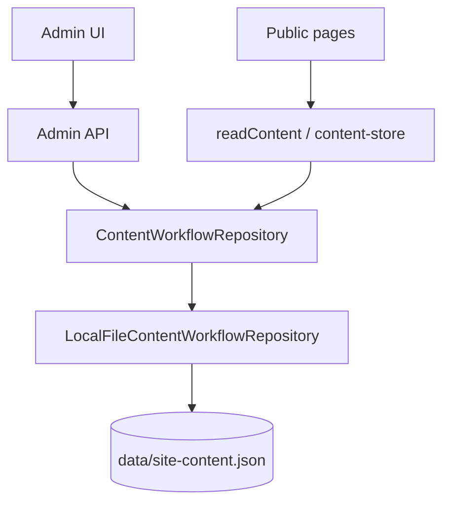
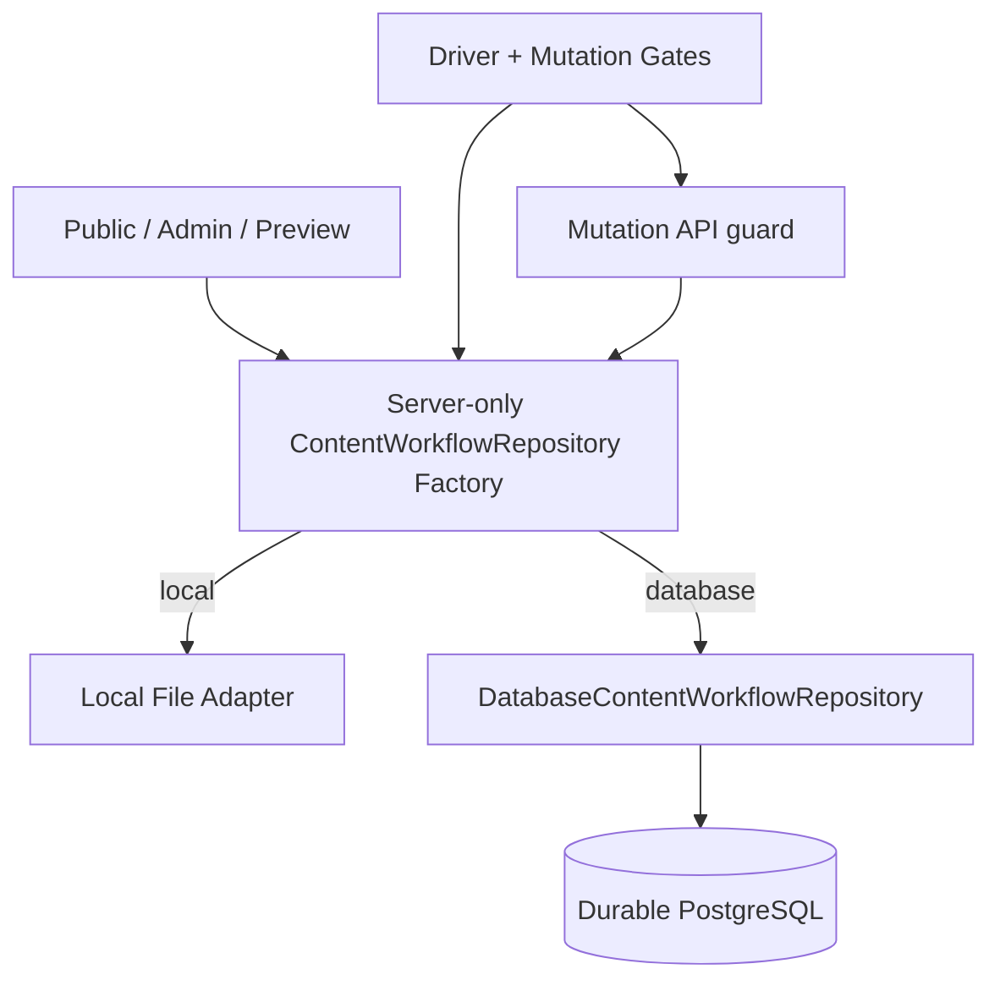
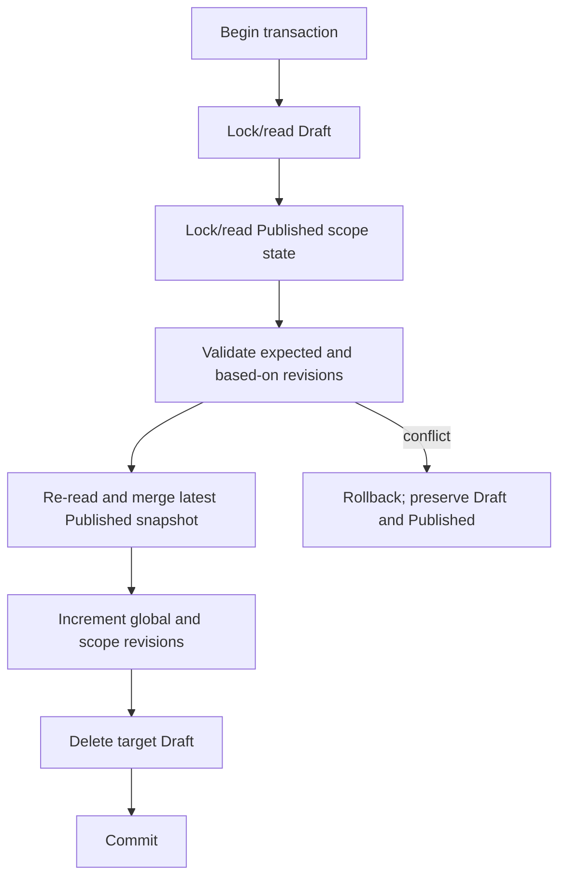

# OFFICE NEXT L8 Durable External Persistence Architecture

> Status: L8A design only; no database resource, adapter, migration, environment change, mutation, or deployment was performed.
> Verified code baseline: `47f90815dd7d8f73325dbbde7036054e8db75788`
> Architecture research date: 2026-07-21

## 1. Executive summary

The durable target is a PostgreSQL repository that preserves the existing `ContentWorkflowRepository` contract and the L1–L7 observable behavior. The recommended storage model is Candidate A: one atomic Published `SiteContent` snapshot, a per-scope version table, and one Draft row per scope. A publish transaction locks and re-reads the latest Published row before merging a single Draft, so concurrent publishes cannot overwrite each other.

The application keeps the Local File adapter for local compatibility and isolated contract tests. A server-only factory selects the adapter; a separate mutation gate remains closed by default. Preview and Production must never share writable data or credentials. Production stays read-only until bootstrap comparison, Preview mutation QA, backup/restore rehearsal, and explicit human release approval all pass.

This document distinguishes:

- **Current verified behavior**: observed in the named baseline code and tests.
- **Recommended future behavior**: the L8B implementation target.
- **Open decision**: requires explicit user approval or later measured evidence.

## 2. Current architecture inventory — verified

### 2.1 Domain and repository contract

`types/content-workflow.ts` defines 14 allowlisted scopes: ten general scopes plus `pageBlocks.home`, `.services`, `.about`, and `.contact`. Revisions are positive integers.

The verified `ContentWorkflowRepository` contract is:

```ts
interface ContentWorkflowRepository {
  readPublished(): Promise<PublishedSnapshot>;
  readEditor<TScope extends ContentScope>(scope: TScope): Promise<EditorSnapshot<TScope>>;
  readPreview(scope: ContentScope): Promise<SiteContent>;
  hasDrafts(): Promise<boolean>;
  saveDraft<TScope extends ContentScope>(input: SaveDraftInput<TScope>): Promise<EditorSnapshot<TScope>>;
  publishDraft<TScope extends ContentScope>(input: PublishDraftInput<TScope>): Promise<EditorSnapshot<TScope>>;
  discardDraft<TScope extends ContentScope>(input: DiscardDraftInput<TScope>): Promise<EditorSnapshot<TScope>>;
}
```

`LocalFileContentWorkflowRepository` implements that interface. `getContentWorkflowRepository()` is in `lib/content-store.ts`, but its return type is the concrete Local File class and every call constructs `LocalFileContentWorkflowRepository` directly. The API action routes call the factory and are already mostly interface-shaped; `readAdminPreview` accepts the concrete `ContentStoreRepository` alias, which is another L8B seam.

### 2.2 Serialization and legacy compatibility

- `data/site-content.json` is currently a Legacy root `SiteContent`, not an Envelope.
- A read parses JSON, classifies missing/Legacy/Envelope state, and converts Legacy to an in-memory Envelope v1 only.
- Read-only access does not rewrite Legacy bytes.
- The first successful workflow mutation serializes the full `ContentEnvelopeV1` with two-space JSON indentation and a trailing newline.
- The write uses a unique same-directory temp file, sync/close, and rename. Failure cleanup is best effort and the previous target remains intact.
- Missing files use `siteContentSeed` in memory. Unknown schema versions and malformed Envelopes fail closed.
- Published content uses top-level seed fallback; `design` and `pageBlocks` are normalized through existing allowlists. Other general scopes do not yet have deep runtime schemas.

### 2.3 Revision and mutation semantics

- Legacy conversion starts global Published revision, every scope Published revision, and timestamps at revision `1`; Drafts are empty.
- First Save Draft requires `expectedDraftRevision=null` and the current scope Published revision, then creates Draft revision `1` with `basedOnPublishedRevision` equal to that Published scope revision.
- Repeated Save Draft increments only the Draft revision and preserves its original base. A stale Draft token, stale Published token, or base mismatch raises `ContentRevisionConflictError`.
- Publish requires the Draft, checks Draft revision, scope Published revision, and `basedOnPublishedRevision`, normalizes and merges only the target scope, increments global and target-scope Published revisions, updates global and target-scope timestamps, then removes only that Draft.
- Discard checks the Draft revision, removes only that Draft, and does not change Published data or metadata.
- `readEditor(scope)` uses Draft if present, otherwise Published; its `publishedUpdatedAt` is scope-specific.
- `readPreview(scope)` overlays only the requested Draft on Published. `readAdminPreview(target)` starts from Published and overlays only a fixed target allowlist; other Drafts do not leak.
- Public `readContent()` calls `noStore()` and delegates to `readPublished()`.

All Local File mutations, including legacy direct mutations, pass through a module-level queue keyed by resolved file path. That prevents lost updates across repository instances in one process. It is not a distributed lock and gives no multi-process or Vercel-instance durability guarantee.

### 2.4 API, authentication, and observable contract

The editor, Draft, and Publish routes authenticate with `rejectIfNotAdmin()` before repository access. The Preview path additionally has middleware session verification, private/no-store headers, `noindex`, and `Vary: Cookie`. Workflow responses preserve the current status and safe error mapping:

- `400` malformed request or revision token.
- `401` unauthenticated.
- `404` unknown scope/page or missing Draft.
- `409` revision conflict or blocked legacy mutation.
- `422` rejected request content.
- `500` sanitized storage/schema/internal error.

L8B must not change response bodies, status codes, target-based Preview composition, Published-only public behavior, normalizer behavior, revalidation timing, authentication, or UI conflict semantics without a separate approval.

### 2.5 Legacy direct Published mutation paths

These verified paths remain outside the formal Draft workflow:

- `PUT app/api/admin/content/[section]/route.ts` calls `updateContentSection()` or `updatePageBlockPage()`.
- `writeContent()`, `updateContentSection()`, `updatePageBlockPage()`, and `resetContentToSeed()` call `replaceLegacyPublished()` or `mutateLegacyPublished()`.
- The Local File adapter allows those writes only while storage is Legacy and raises `LegacyContentWriteBlockedError` after Envelope conversion.

Recommended future behavior: Database mode must not implement direct Published mutation. The old PUT route must be blocked by the mutation policy or retired after caller inventory. Local mode may retain the compatibility methods temporarily, but they must not be part of the shared durable repository contract.

## 3. Architecture diagrams

### 3.1 Current



### 3.2 Target



### 3.3 Publish semantic sequence



Implementation note: to avoid deadlocks, every write operation must acquire physical rows in the same order: `content_sites`, then `content_scope_versions`, then `content_drafts`. The diagram above expresses the required semantic checks; the implementation obtains the site snapshot lock first, then reads the Draft and scope state under the same transaction.

## 4. Target data model

### 4.1 Chosen model: Candidate A

Use:

- `content_sites`: one complete Published snapshot and global metadata per site/environment.
- `content_scope_versions`: one Published revision/timestamp row for each allowlisted scope.
- `content_drafts`: at most one Draft per scope.

This preserves the current atomic full-site `readPublished()` and makes public rendering one snapshot read plus the version rows needed for editor metadata. It serializes publishes briefly on the single site row, which is acceptable for this low-write CMS and is safer than reconstructing a full snapshot from independently changing rows.

Candidate B (one Published row per scope) is not selected because `readPublished()` would need multi-row snapshot assembly, public rendering would perform more work, global revision consistency would need an additional coordinator row anyway, and migration/comparison become more complex. Candidate B is only worth reconsidering if measured content size or publish contention makes the single JSONB row a proven bottleneck.

### 4.2 PostgreSQL design SQL

**DESIGN ONLY — DO NOT EXECUTE**

```sql
CREATE TABLE content_sites (
  site_key text NOT NULL,
  environment text NOT NULL,
  schema_version integer NOT NULL,
  published_content jsonb NOT NULL,
  published_revision bigint NOT NULL,
  published_updated_at timestamptz NOT NULL,
  created_at timestamptz NOT NULL DEFAULT transaction_timestamp(),
  updated_at timestamptz NOT NULL DEFAULT transaction_timestamp(),
  PRIMARY KEY (site_key, environment),
  CONSTRAINT content_sites_schema_version_positive CHECK (schema_version >= 1),
  CONSTRAINT content_sites_revision_positive CHECK (published_revision >= 1),
  CONSTRAINT content_sites_content_object CHECK (jsonb_typeof(published_content) = 'object'),
  CONSTRAINT content_sites_environment_nonempty CHECK (btrim(environment) <> ''),
  CONSTRAINT content_sites_site_key_nonempty CHECK (btrim(site_key) <> '')
);

CREATE TABLE content_scope_versions (
  site_key text NOT NULL,
  environment text NOT NULL,
  scope text NOT NULL,
  published_revision bigint NOT NULL,
  published_updated_at timestamptz NOT NULL,
  PRIMARY KEY (site_key, environment, scope),
  FOREIGN KEY (site_key, environment)
    REFERENCES content_sites (site_key, environment) ON DELETE RESTRICT,
  CONSTRAINT content_scope_revision_positive CHECK (published_revision >= 1),
  CONSTRAINT content_scope_allowlist CHECK (scope IN (
    'brand','home','founder','services','cases','testimonials','faq',
    'contact','social','design','pageBlocks.home','pageBlocks.services',
    'pageBlocks.about','pageBlocks.contact'
  ))
);

CREATE TABLE content_drafts (
  site_key text NOT NULL,
  environment text NOT NULL,
  scope text NOT NULL,
  value jsonb NOT NULL,
  revision bigint NOT NULL,
  based_on_published_revision bigint NOT NULL,
  updated_at timestamptz NOT NULL,
  PRIMARY KEY (site_key, environment, scope),
  FOREIGN KEY (site_key, environment, scope)
    REFERENCES content_scope_versions (site_key, environment, scope) ON DELETE RESTRICT,
  CONSTRAINT content_draft_revision_positive CHECK (revision >= 1),
  CONSTRAINT content_draft_base_positive CHECK (based_on_published_revision >= 1),
  CONSTRAINT content_draft_json_shape CHECK (jsonb_typeof(value) IN ('object','array'))
);

CREATE INDEX content_drafts_site_environment_idx
  ON content_drafts (site_key, environment);
```

The composite primary keys enforce site/environment isolation and one Draft per scope. The Draft foreign key inherits the exact scope allowlist from pre-created scope rows. L8B migration code must create exactly all 14 scope rows and verify cardinality; SQL constraints alone cannot conveniently enforce “all 14 exist.”

Application validation remains authoritative for `SiteContent` and typed scope shapes. SQL validates identity, revision minima, referential integrity, and broad JSON shape. Timestamps come from PostgreSQL `transaction_timestamp()` so application clock skew cannot create inconsistent audit metadata.

Delete semantics are restrictive: runtime credentials cannot delete site rows or scope-version rows. Discard deletes one Draft. Site/environment teardown is an explicit administrative migration, never a runtime path.

Append-only Published history is not part of v1. Reserve a future `content_publish_events` design keyed by site/environment and monotonically increasing global revision, but do not implement it in L8B-1 through L8B-4. Until approved, provider PITR plus encrypted snapshot exports provide recovery evidence.

## 5. Transaction and concurrency model

### 5.1 `readPublished`

Read `content_sites` plus its 14 `content_scope_versions` rows in a read-only `REPEATABLE READ` transaction. Return the snapshot only if schema version is supported and all allowlisted scope rows exist. Public reads remain `no-store` in the first database release. A cache may be introduced later only with publish-driven invalidation and Draft-proof cache keys.

### 5.2 `readEditor(scope)`

In one read-only transaction, read the scope-version row and optional Draft. If a Draft exists, normalize and return it; otherwise extract and normalize the scope from `published_content`. Return the current scope Published revision/timestamp and Draft metadata exactly as today.

### 5.3 `readPreview(scope)` and page preview

Read one consistent Published snapshot, then overlay only the requested scope Draft. The higher-level Admin page preview continues to iterate its fixed target allowlist. No database query accepts an arbitrary JSON path or user-selected list of scopes. Public callers never receive a preview-capable repository facade.

### 5.4 `saveDraft`

Use one transaction and canonical lock order:

1. Lock the site row and target scope-version row.
2. Lock the Draft row if present.
3. Compare current Draft revision with `expectedDraftRevision`.
4. Compare target Published revision with `expectedPublishedRevision`.
5. If updating, require stored `based_on_published_revision` to equal current Published revision.
6. Normalize/validate the scope value in the application.
7. Insert revision `1`, or update with `revision = revision + 1`; preserve the initial base.
8. Use database transaction time for `updated_at`; commit.

An alternative single-statement CAS may be used only if it returns enough current metadata to preserve the existing safe 409 response and has contract-test equivalence.

### 5.5 `publishDraft`

In one transaction, lock site → scope version → Draft; fail `DRAFT_NOT_FOUND` if absent. Validate expected Draft, expected Published, and stored base. Re-read the locked latest `published_content`, normalize the Draft, merge only its typed scope, update the site snapshot/global revision/global timestamp, update the scope revision/timestamp, delete that Draft, and commit. No snapshot may be assembled outside the transaction.

Different-scope publishes are intentionally serialized on `content_sites`. Admin A publishing `home` commits a fresh snapshot before Admin B publishing `services` re-reads and merges, so neither can overwrite the other. This favors integrity over write throughput.

### 5.6 `discardDraft`

Lock site → scope version → Draft in one transaction, require existence and matching Draft revision, delete only that Draft, and return the unchanged Published editor snapshot. Missing/stale outcomes retain their current 404/409 semantics.

### 5.7 Deadlocks and retries

- All mutations use identical physical lock order.
- Retry at most two times after the initial attempt, with bounded jitter.
- Retry only SQLSTATE `40001` (serialization failure), `40P01` (deadlock), and a verified transient connection failure before commit outcome is known.
- Never retry revision conflicts, missing Draft, validation errors, unknown schema, permission errors, or ambiguous commit outcomes as if they were safe.
- Log operation name, masked site/environment identifier, scope, attempt, SQLSTATE, duration, and success/failure; never log content JSON or connection strings.

## 6. Repository adapter and factory

Recommended L8B structure:

```text
types/content-workflow.ts                 shared contract
lib/content-workflow-repository.ts        Local File adapter (temporary location)
lib/database-content-workflow-repository.ts server-only DB adapter
lib/content-workflow-repository-factory.ts server-only driver selection
lib/content-mutation-policy.ts            mutation gate
```

The factory returns `ContentWorkflowRepository`, not a concrete adapter. Mark database modules `server-only`, load them lazily after runtime selection, and do not export them through client-importable barrels. Routes and Server Components use the same factory; tests inject a repository directly or replace a factory provider.

Use Node.js Runtime for database workflow routes in the first release. Do not initialize a connection during module evaluation, `next build`, static generation, or metadata generation. Create a bounded module-level pool lazily and reuse it within a warm instance. Use the provider’s pooled TLS endpoint and parameterized SQL.

Recommended dependency category: a direct, portable PostgreSQL driver (`pg`) with explicit transactions and SQL migrations; no ORM in the first adapter. This keeps lock order and revision conditions reviewable and works with local PostgreSQL and the fallback provider. A query builder/ORM can be reconsidered only if it preserves transaction control and does not generate unsafe read-modify-write sequences.

Database mode implements only the formal workflow contract. Legacy direct Published methods are not added. `ContentStoreRepository` and `readAdminPreview` must be widened to `ContentWorkflowRepository`; public `readContent()` remains a Published-only facade.

## 7. Environment isolation

| Environment | Durable target | Identity and credential policy |
| --- | --- | --- |
| Local | Local PostgreSQL container or Local File contract fixture | Development-only credential; never Production data |
| Test | Disposable local PostgreSQL database/schema per worker | Random test identity; migrate then drop after suite |
| Preview | Separate provider project/database from Production; optional ephemeral branch per PR | Preview-only credential and `site_key`; no Production clone containing sensitive data |
| Production | Dedicated Production project/database | Credential exists only in Vercel Production scope |

Preview and Production must not share writable rows, credentials, or a database. A shared cluster is acceptable only if the provider gives separate databases/roles and an explicit security review approves it; separate provider projects are preferred for blast-radius isolation.

Preview branches may share a sanitized Preview baseline, not a Production writable branch. For parallel PRs, use an ephemeral database branch when available; otherwise include an immutable deployment namespace in `CONTENT_ENVIRONMENT` and enforce cleanup by expiry. A single long-lived Preview database is acceptable for sequential QA only if each run uses a unique site/environment identity and cleanup is verified.

Build and static generation must not connect to the database. Dynamic public requests connect at runtime. Preview migrations run and verify before switching its driver. Production migration always requires an explicit human authorization recorded with source hash, target identity, backup evidence, and rollback owner.

## 8. Feature flags and defense in depth

Variable names only:

- `CONTENT_PERSISTENCE_DRIVER`: `local` or `database`.
- `CONTENT_MUTATIONS_ENABLED`: strict boolean parser; missing/invalid means false.
- `CONTENT_DATABASE_URL`.
- `CONTENT_SITE_KEY`.
- `CONTENT_ENVIRONMENT`.
- `CONTENT_DATABASE_SSL_MODE` (only if the driver cannot infer required TLS safely).

Responsibilities:

1. UI may hide/disable mutation actions for clarity, but is not a security boundary.
2. Mutation API routes reject before parsing content or constructing a writable repository when the gate is closed.
3. Repository mutation methods re-check policy, preventing internal callers from bypassing routes.
4. Database runtime role has only required `SELECT/INSERT/UPDATE/DELETE` privileges on workflow rows, never schema migration or role-management rights.
5. Factory fails closed on unknown driver, Production Local File mutation, identity mismatch, missing database configuration, or build-time construction.

`database + mutations=false` is the required first Preview and Production cutover state. `local` in Vercel must always be read-only and must never be described as durable.

## 9. Security, observability, and failure handling

- Database access is server-only; no credential, query capability, or raw content payload enters client bundles.
- Use separate runtime and migration roles, least privilege, TLS verification, parameterized queries, scoped credential rotation, and Preview/Production credential separation.
- Keep current Admin authentication/authorization unchanged; the repository receives only already-authorized workflow calls and still validates scope allowlists and content.
- Sanitize database errors through existing workflow error mapping. Never return SQL, host, username, connection string, stack, Draft value, or Published content.
- Logs contain request correlation ID, operation, scope, masked environment/site identity, duration, retry count, SQLSTATE class, revision numbers, and outcome—not full payloads or secrets.
- Add metrics for operation latency, conflict count, transaction retries, missing Draft, connection acquisition, storage failures, and mutation-gate denials.
- Timeouts, pool exhaustion, provider outage, or unknown commit state fail closed. Reads may not silently fall back from database to stale Local JSON in Production.
- Health checks verify connectivity and schema compatibility without dumping data. Readiness must not perform mutations.

## 10. Testing architecture

### 10.1 Shared repository contract suite

Run the same tests against Local File and Database adapters:

- `readPublished`, editor fallback/Draft, single-scope Preview, and `hasDrafts`.
- first/repeated Save Draft.
- stale Draft, stale Published, and stale base conflicts.
- Publish success/missing Draft/storage rollback.
- Discard success/missing/stale Draft.
- different-scope isolation.
- concurrent same-scope Save and different-scope Publish.
- normalization and failure atomicity.

The suite owns adapter setup/teardown and a deterministic clock assertion strategy. Database timestamps are asserted relationally or against captured transaction time, not a fake app clock.

### 10.2 Database integration tests

Use a real disposable PostgreSQL database, not a mocked SDK. Apply migrations, seed a unique `(site_key, environment)`, and clean by dropping the test database/schema. Disable parallelism within one identity; parallel workers receive separate databases or identities. CI secrets are scoped to the test environment and masked. Provider-specific smoke tests are a separate, opt-in gate and provider outage is reported distinctly from product regression.

### 10.3 API, migration, and browser gates

- Existing API tests must preserve status, safe error payload, auth-before-access, mutation gate, snapshots, Publish response, Discard response, and revalidation-after-commit.
- Migration tests cover Legacy import, Envelope semantic equivalence, unchanged formal hash, zero initial Drafts, unknown/malformed rejection, retry/idempotency, and repeated bootstrap refusal/no-op rules.
- L8B Browser QA covers public pages, Admin login/dashboard/editor, Save/Preview/public isolation/conflict/Discard/Publish/refresh continuity, and Preview/Production isolation.
- Do not restart broad hydration soak. React `#418` remains an intermittent recoverable monitored known issue unless new supported evidence warrants a separate repair task.

## 11. Open decisions

1. Approve Neon Postgres as primary and Supabase Postgres as fallback.
2. Approve direct `pg` driver plus plain SQL migrations, or request a different dependency review.
3. Select paid/free provider plan only after current usage, backup retention, support, and billing terms are reviewed by the user.
4. Approve separate Production and Preview provider projects and the Preview branch lifecycle.
5. Approve RPO/RTO and backup retention targets in the migration runbook.
6. Decide whether append-only publish audit events enter a later L8C; they are intentionally excluded from initial L8B.
7. Explicitly approve each Production bootstrap, read-only cutover, and mutation release as separate gates.
